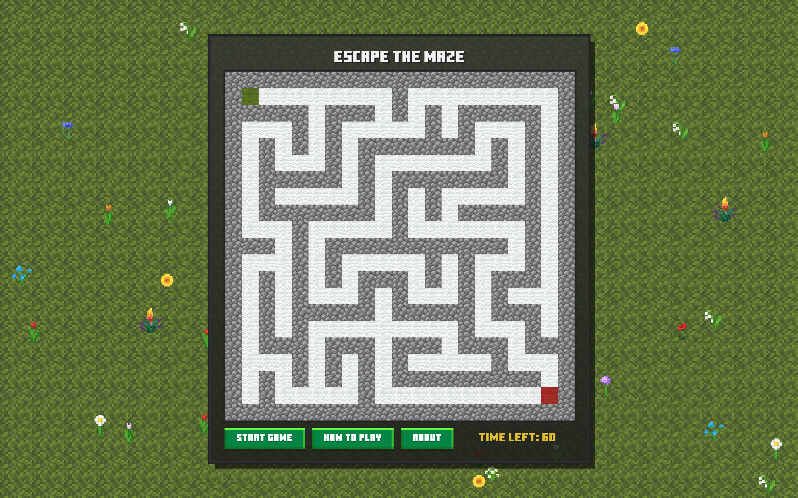
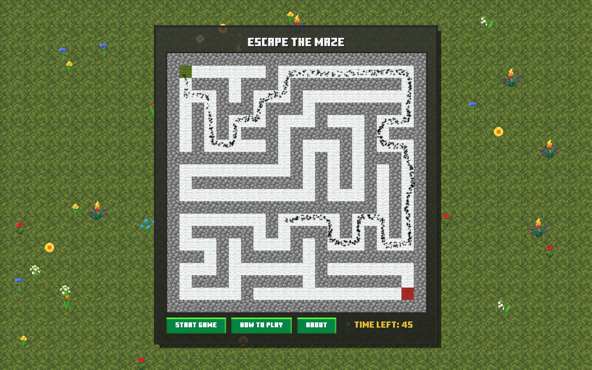
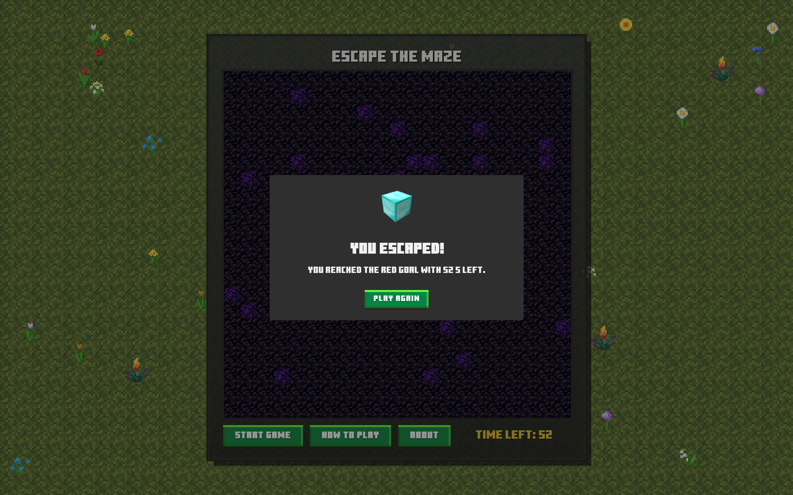
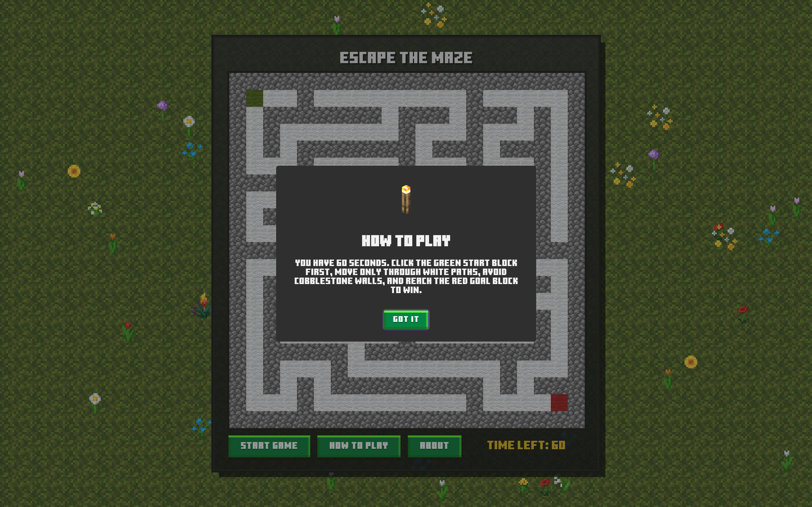

<h1 align="center">Escape Maze</h1>

<p align="left">
A Minecraft-themed browser maze game built with vanilla HTML, CSS, and JavaScript. Each run generates a fresh maze, lets the player draw a path from the green start tile to the red goal tile, and layers in Minecraft-style textures, ambient cave audio, timer pressure, reverse-path replay, and an obsidian win animation.
</p>

---

### Table of Contents

- [Features](#features)
- [Screenshots](#screenshots)
- [Tech Stack](#tech-stack)
- [Project Structure](#project-structure)
- [Setup and Usage](#setup-and-usage)
- [Notes](#notes)
- [Author](#author)
- [License](#license)

---

## Features

- **Random Maze Generation** - A new 21x21 maze is carved on page load using a recursive backtracker algorithm.
- **Canvas-Based Draw Gameplay** - Start on the green tile, drag through valid paths, and lose instantly if the cursor crosses a wall.
- **60-Second Survival Timer** - Each round is timed, with a final TNT countdown sound in the last seconds.
- **Minecraft Presentation** - Texture-pack tiles, pixel fonts, flower-filled backgrounds, and chunky UI styling shape the whole experience.
- **Audio-Driven Game Feel** - Button clicks, orb start audio, cave ambience, TNT countdown, and win sounds reinforce each state.
- **Win Animation Sequence** - A successful run replays the drawn path in reverse, triggers particles, and transforms the maze into obsidian.
- **SweetAlert2 Menus and Feedback** - How-to-play, about, win, and loss states are shown with themed modal dialogs.

---

## Screenshots


*Full page view showing the Minecraft-styled maze, flowers in the background, and the control buttons under the canvas.*


*An active round with the player drawing through the maze from the green start tile toward the red goal tile.*


*The post-win obsidian maze effect with the completed path replay and celebration visuals.*


*The themed instruction modal that explains the rules, timer, and movement constraints.*

---

## Tech Stack

- **HTML5** - Page structure, canvas, buttons, and modal trigger points
- **CSS3** - Custom properties, layout, Minecraft-inspired styling, and pixel rendering
- **Vanilla JavaScript** - Maze generation, path validation, timer flow, particles, and audio control
- **SweetAlert2** - Styled modal dialogs for instructions, about, win, and loss states

---

## Project Structure

```text
maze/
├── index.html
├── LICENSE
├── README.md
├── assets/
│   ├── block/              # Minecraft textures used for maze tiles and background flowers
│   ├── favicons/           # Browser favicon set and web manifest
│   ├── minecraft-font/     # Local Minecraft font files
│   ├── sound/              # Button, cave, TNT, orb, and win audio
│   └── swal_icons/         # Images used inside SweetAlert2 dialogs
├── js/
│   ├── audioManager.js     # Round audio, ambience scheduling, and sound effects
│   ├── flowerSpawner.js    # Flower creation and random background placement
│   ├── gameDrawing.js      # Mouse tracking, wall detection, and reverse-path replay
│   ├── main.js             # App setup, constants, event listeners, and modal wiring
│   ├── mazeObsidian.js     # Obsidian end-state rendering after a win
│   ├── particle.js         # Pixel explosion overlay and animation loop
│   ├── randMazeGen.js      # Recursive backtracker maze generation and canvas tile drawing
│   └── timerLifecycle.js   # Round timer, reset flow, timeout handling, and win sequence
└── style/
    ├── buttons.css         # Pixel-style button appearance and interactions
    └── style.css           # Layout, panel styling, canvas sizing, and background theme
```

---

## Setup and Usage

1. **Clone the repository**
   ```bash
   git clone https://github.com/majtobijakodric/maze.git
   cd maze
   ```

2. **Open the project in a browser**
   - Use a local static server such as VS Code Live Server, or any simple HTTP server.

3. **Play the game**
   - Click **Start Game** to begin the round.
   - Click the green start tile first.
   - Drag only through open path tiles and reach the red goal tile before time runs out.

---

## Notes

- The maze is generated once on load, and each round reset redraws the same layout instead of generating a new one.
- Collision detection checks the mouse path segment against maze tiles, so touching a wall ends the run immediately.
- Winning a round triggers a reverse replay of the drawn path, then swaps the maze visuals to obsidian before showing the win modal.
- For the screenshot section above, create the image files inside `assets/` using the exact names shown there.

---

## Author

**Maj Tobija Kodric**

---

## License

This project is licensed under the MIT License. See [LICENSE](LICENSE) for details.
